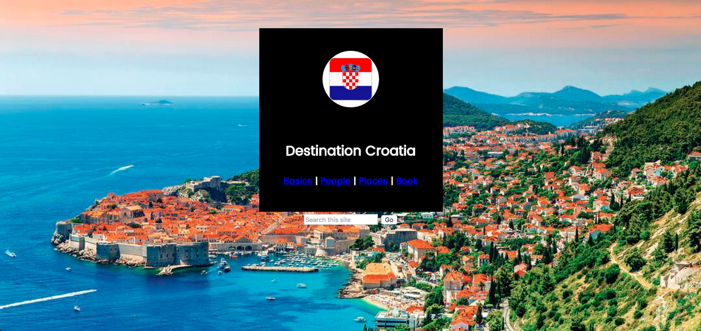

# Amy WOD: Travel

For this individual WOD, you will use HTML and CSS to create a very simple page based on a travel destination of your choice. You must use pure HTML and CSS. 
No frameworks like Twitter Bootstrap or Semantic UI allowed!

## Steps

  1. Create a GitHub repo called "traveldestination" and clone it to your local computer.

  2. Create an IntelliJ project in your repo called "traveldestination" that contains two files, index.html and style.css. Do all editing within IntelliJ.

  3. If you want, you can use LiveReload (or equivalent) to speed up development.

  4. Choose a country that you are interested in or would like to travel to. The title of the page is "Destination [your country name here]".

  5. Find an aesthetically pleasing background image related to your country. Set it as the background image for your entire page. The larger the picture, the clearer it will appear in the background.
  
  6. Choose and use a font from Google Fonts. -- "Poppins."
  
  7. Place a black box in the center of your page. Create a class called black-box to set both the width and height to 325px and set the margin from the top of the page to 50px. 
  You also need to center the box horizontally within the page. Also include "text-align: center;" so all text and image contents of this block will be centered.
  
  8. Find a square image of your country's flag. Place it in the center of the black box. Create a class called flag-image in your CSS file to format your flag image as follows:
   Set the top margin to 40px, set the width of the image to 100px, and make the image circular by setting the border-radius to 50%.

  9. Underneath your flag image, provide a centered headline (h2) called "Destination [enter country name here]". Set the top padding to 15px, set the font to the Google font you
   
   chose earlier, and set the font color to white. You may also change the font size if you like.

  10. Underneath your headline, include 4 centered links called "Basics", "People", "Places" and "Book." To do this, you may simply create a paragraph that includes some links. 
  
  Separate your links with a pipe symbol. You may put actual links on your page or you may simply use dead (#) links. You may use the same Google font as the header, or you may use a different font. 
  You may also need to adjust the margins so that it appears nicely within the black box.
  
  11. Underneath your black box, include a search bar. The placeholder text should be "Search this site" and the button text should be "Go".
   Hint: you did this while creating your Cat App on [freecodecamp](freecodecamp.com). Set the width to 200px. Make sure the search bar is aligned nicely underneath the black box.
  
  12. Make sure your final page looks simiar to this image: 

  13. Now commit your branch to GitHub, and check to see that it's there.

  14. Raise your hands and I will check your work.

### Submission instructions

You do not have to submit this Amy WOD. 



 


  
  
 
